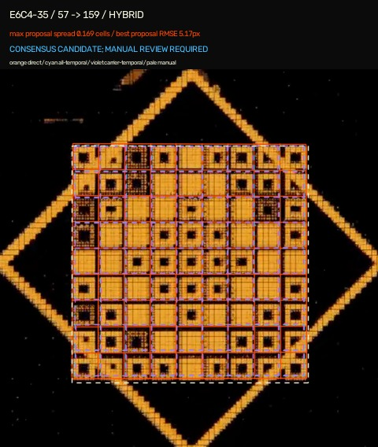
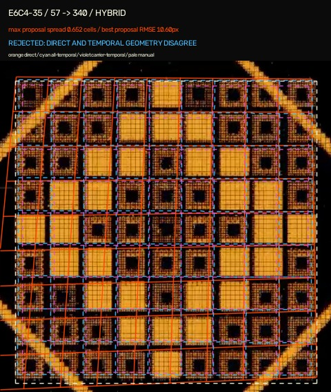

# Hybrid registration spike

Status: **experimental, not canonical evidence**.

This follow-up tests a conservative geometry-consensus gate around the [LoFTR baseline](../vision-registration-spike/README.md). It does not load glyph IDs, fingerprints or cell states, and it cannot enable evidence overlays.

## Method

For each target frame, [`pipeline/hybrid_registration_spike.py`](../../pipeline/hybrid_registration_spike.py) produces and compares:

1. a direct reference-to-target LoFTR homography;
2. a chain of LoFTR similarity transforms over at most 24 decoded frames per hop;
3. a second temporal chain fitted only from correspondences outside the evolving payload box when sufficient carrier remains visible;
4. an independent Sobel edge-projection check for the ten horizontal and ten vertical lattice boundaries;
5. an independent diagonal Hough-line check against the projected carrier diamond when that diamond is sufficiently visible.

The operational decision uses only proposal agreement, match/inlier statistics, lattice support, diamond support and declared visibility. Approximate manual target corners are compared afterward to measure experimental false positives and false negatives; this feasibility set was also used while choosing exploratory thresholds, so it is not an independent validation set.

Orange, cyan and violet identify direct, all-feature temporal and carrier-only temporal provenance respectively. The pale dashed rectangle is manual evaluation geometry.

## Result

The CPU-only 480×480 evaluation took 155.60 seconds of model inference. Six of eight pairs became review candidates. Both operational rejections were safe, and none of the six candidates was a false positive against the eight-pixel manual evaluation gate.

| Recording | Pair | Maximum required-proposal spread | Best evaluation corner RMSE | Operational result |
| --- | --- | ---: | ---: | --- |
| E6C4-16 | 491 → 575 | 0.026 cells | 1.66 px | candidate |
| E6C4-16 | 491 → 653 | 0.045 cells | 2.64 px | candidate |
| E6C4-13 | 415 → 445 | 0.091 cells | 1.50 px | candidate |
| E6C4-13 | 415 → 537 | 0.125 cells | 1.65 px | candidate |
| E6C4-35 | 57 → 159 | 0.169 cells | 5.17 px | candidate |
| E6C4-35 | 57 → 340 | 0.652 cells | 10.60 px | reject: proposals disagree |
| E6C2-1K | 238 → 310 | 0.043 cells | 6.18 px | candidate |
| E6C2-1K | 238 → 389 | 0.063 cells | 6.17 px | reject: carrier chain unavailable |

This is 75% candidate coverage and 100% candidate precision on this deliberately small, threshold-development sample. It is neither an out-of-sample nor corpus-wide accuracy claim.



The extreme E6C4-35 frame 340 is rejected without looking at its manual target coordinates. Direct and temporal proposals spread over 0.65 cell pitches, while the subsequent manual evaluation confirms that none is within eight pixels.



The E6C2-1K frame 389 result shows the intended conservative failure mode. Direct and ordinary temporal geometry are accurate, but only one carrier correspondence survives the final crop; the gate rejects it instead of silently relaxing provenance requirements.

Complete source hashes, intermediate frame steps, proposal corners, lattice/diamond metrics, thresholds and decisions are in [`results.json`](results.json).

## Reference-label correction

The hybrid diamond check exposed that the original E6C4-35 frame 57 reference grid was one pitch above the carrier centre. The normalized reference was corrected from vertical bounds `0.2297–0.6859` to `0.2804–0.7366`. Its target labels were not changed. Rerunning the untouched model then changed frame 159 from an apparent failure to a valid 5.17 px direct registration.

This correction is preserved in [`pipeline/vision_spike_config.json`](../../pipeline/vision_spike_config.json). It demonstrates why reviewed reference geometry must itself have at least two sources of support.

## Reproduce

Use the isolated dependencies and hash-verified checkpoint described by the [baseline spike](../vision-registration-spike/README.md), verify all source inputs, then run:

```powershell
.\.vision-venv\Scripts\python.exe pipeline\hybrid_registration_spike.py `
  --archive-invest ..\ArchiveInvest `
  --video-dir ..\source-videos `
  --ffmpeg C:\tools\ffmpeg\bin\ffmpeg.exe `
  --checkpoint .\loftr_outdoor.ckpt
```

Use `--recording E6C4-35` for a focused run. Outputs default to the ignored `.pipeline-work/hybrid-vision-spike/run/` directory. Every accepted result remains a manual-review candidate; no current command promotes it into `data/evidence.json`.

## Next step

The next useful milestone is a recording-level backfill that reuses one temporal chain per source and emits proposed geometry for all 587 manual occurrences. Before promotion, test it with whole-recording holdouts, manually review all rejections and a stratified candidate sample, and define a separate reviewed-data migration step.
