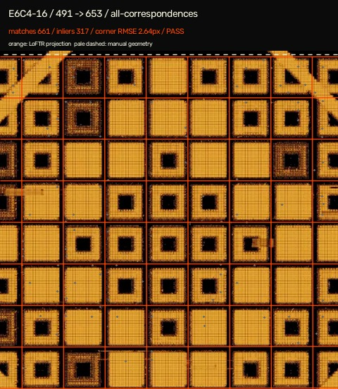
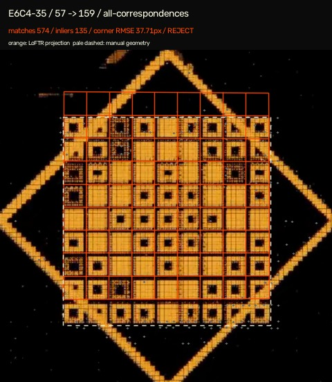

# LoFTR registration spike

Status: **experimental, not canonical evidence**.

This spike tests whether a pretrained vision matcher can propagate a manually reviewed 9×9 grid from one exact decoded frame to later frames in the same recording. It does not read ArchiveInvest fingerprints, glyph IDs, or cell values. Nothing in this directory enables a site overlay or changes a catalogue assignment.

The implementation uses [Kornia's LoFTR](https://kornia.readthedocs.io/en/latest/feature.html#kornia.feature.LoFTR) outdoor checkpoint to produce correspondences, then OpenCV USAC/MAGSAC to estimate a homography. The method follows the detector-free coarse-to-fine matching approach described in the [LoFTR paper](https://openaccess.thecvf.com/content/CVPR2021/html/Sun_LoFTR_Detector-Free_Local_Feature_Matching_With_Transformers_CVPR_2021_paper.html).

## Inputs and provenance

The trial covers four visually different ArchiveInvest sources. Frame numbers are zero-based decoded-frame indices against the exact filename shown here.

| Recording | Exact source | Reference | Targets | Purpose |
| --- | --- | ---: | --- | --- |
| E6C4-16 | `E6C4-16.mp4` | 491 | 575, 653 | close-up and heavy crop |
| E6C4-13 | `E6C4-13.mp4` | 415 | 445, 537 | standard and moderate zoom |
| E6C4-35 | `E6C4-35.mp4` | 57 | 159, 340 | distant source and strong zoom |
| E6C2-1K | `E6C2-1K zoomed.mp4` | 238 | 310, 389 | documented derived-video override |

The runner refuses an input unless its SHA-256 matches [`data/source_integrity.json`](../../data/source_integrity.json). The four reference grids and eight target grids were visually annotated as normalized corner coordinates in [`pipeline/vision_spike_config.json`](../../pipeline/vision_spike_config.json). Those approximate manual labels are an evaluation aid, not a new evidence source.

The exact pretrained checkpoint used was 46,341,978 bytes with SHA-256 `21f5bec5968178e8bc8b7633441836fe5de4f47d861dd2cd7dc38e271b0479ec`. The runner verifies that identity before model loading.

## Result

On a CPU-only PyTorch 2.13.0 run at 480×480, inference took a median 3.43 seconds per image pair. The primary all-correspondence strategy passed 5 of 8 proposed gates and produced a median 4.41 px corner RMSE against the approximate manual geometry.

| Recording | Pair | Matches / inliers | Median match error | Corner RMSE | Gate |
| --- | --- | ---: | ---: | ---: | --- |
| E6C4-16 | 491 → 575 | 1458 / 1133 | 1.05 px | 1.66 px | pass |
| E6C4-16 | 491 → 653 | 661 / 317 | 1.19 px | 2.64 px | pass |
| E6C4-13 | 415 → 445 | 1118 / 758 | 0.91 px | 2.30 px | pass |
| E6C4-13 | 415 → 537 | 897 / 634 | 1.10 px | 1.65 px | pass |
| E6C4-35 | 57 → 159 | 574 / 135 | 1.52 px | 37.71 px | reject |
| E6C4-35 | 57 → 340 | 193 / 16 | 0.96 px | 54.26 px | reject |
| E6C2-1K | 238 → 310 | 624 / 277 | 1.43 px | 6.18 px | pass |
| E6C2-1K | 238 → 389 | 264 / 48 | 1.64 px | 7.16 px | reject: low inlier ratio |

Orange is the model-projected lattice. The pale dashed rectangle is the independent manual geometry label.



The E6C4-35 `57 → 159` result demonstrates the important counterexample. The matcher reports 135 inliers with a low 1.52 px median reprojection error, but the projected lattice is displaced by approximately one repeating grid period. Match statistics alone therefore cannot prove correct registration.



Filtering reference matches to points outside the labelled payload grid did not solve the ambiguity: it accepted 4 of 7 estimable pairs and retained the E6C4-35 false lock. Complete matrices, predicted/manual corners, source hashes, thresholds and all renders are in [`results.json`](results.json).

## Decision

LoFTR is useful as a **registration proposal generator**, not as the sole authority for an evidence overlay. A production attempt should add at least:

- multiple reviewed reference templates for distinct zoom regimes;
- an independent grid-line or diamond-geometry fit;
- temporal agreement with adjacent decoded frames;
- explicit rejection when strategies disagree by a material fraction of one cell pitch;
- whole-recording holdouts before any automatic promotion.

A trained landmark heatmap model remains a reasonable fallback if these checks cannot provide sufficient coverage. Its training labels should contain geometry only, and corpus fingerprints must remain excluded until post-detection comparison.

## Reproduce

Create a separate environment; these packages are not site dependencies:

```powershell
python -m venv .vision-venv
.\.vision-venv\Scripts\python.exe -m pip install -r pipeline\requirements-vision-spike.txt
```

Download and verify the upstream checkpoint:

```powershell
curl.exe -L --fail --output loftr_outdoor.ckpt `
  http://cmp.felk.cvut.cz/~mishkdmy/models/loftr_outdoor.ckpt
Get-FileHash .\loftr_outdoor.ckpt -Algorithm SHA256
```

Run the spike only after the normal source-integrity check succeeds:

```powershell
python pipeline\inventory_sources.py --verify `
  --downloaded-dir ..\source-videos `
  --archive-video-dir ..\ArchiveInvest\Videos

.\.vision-venv\Scripts\python.exe pipeline\vision_registration_spike.py `
  --archive-invest ..\ArchiveInvest `
  --video-dir ..\source-videos `
  --ffmpeg C:\tools\ffmpeg\bin\ffmpeg.exe `
  --checkpoint .\loftr_outdoor.ckpt
```

Outputs default to the ignored `.pipeline-work/vision-spike/run/` directory. Review the generated overlays and `results.json`; do not copy coordinates into canonical evidence merely because a metric passes.
